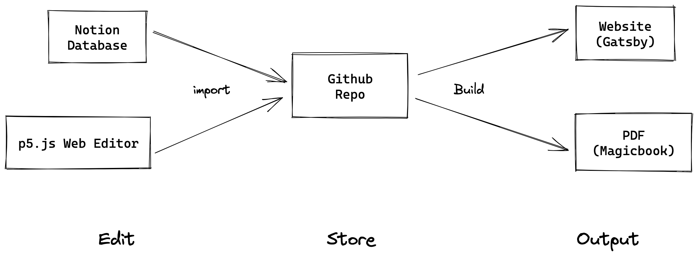
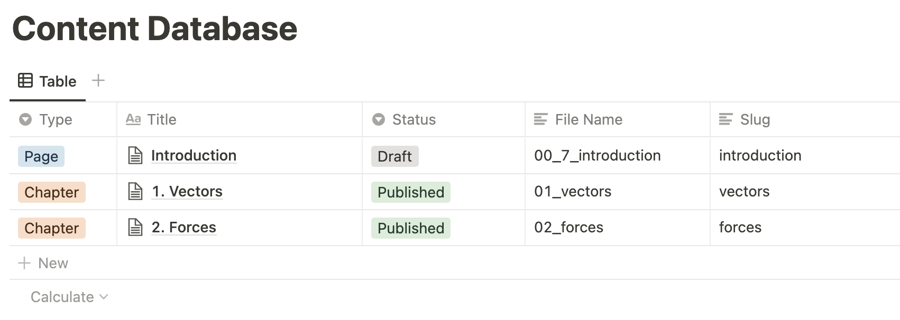

# The Nature of Code (2024 p5.js update!)

This repo contains all the files for [the Nature of Code book](https://natureofcode.com/). The source content for the book is in a private Notion database and imported here as raw HTML files (which are then used to build the print PDF and gatsby website).

If you are looking for the 2012 Nature of Code book, [the website is archived here](https://noc-processing-archive.netlify.app/) along with the [GitHub source archive](https://github.com/nature-of-code/Nature-of-Code-Website-Archive).



## Edit & Import



Content are stored in a Notion Database with the following attributes:

- Type (`Page` | `Chapter`): to be handled differently during builds, now only act in the website build.
- Title: defines the title
- Status (`Draft` | `Published`): only `Published` ones will be imported
- File Name: defines the page sequence in a pdf build
- Slug: defines the path in web page URL

Each entity also contains a page of its content, which will be transformed to `html` files based on the [schema](docs/import-schemes.md). The transformation script ([nature-of-code/fetch-notion](https://github.com/nature-of-code/fetch-notion)) is written in Node.js, utilized as a GitHub action.

## Build

Following are the steps to build the book and website, however, you will have to skip the `import-notion-docs` as that can only be done with the Notion API key associated with the book. You can find the latest HTML version of the book in `/content`.

```bash
# Install Dependencies
npm install

# Build PDF (Magicbook) in `build` directory
npm run build:pdf

# Build Website in `public` directory
npm run build
```

## Attributions

Icons used in this project:

🖍️ (Crayon) & 🦜 (Parrot) & 🔎 (Magnifying glass) from [OpenMoji](https://openmoji.org/) – [CC BY-SA 4.0](https://creativecommons.org/licenses/by-sa/4.0/#)
