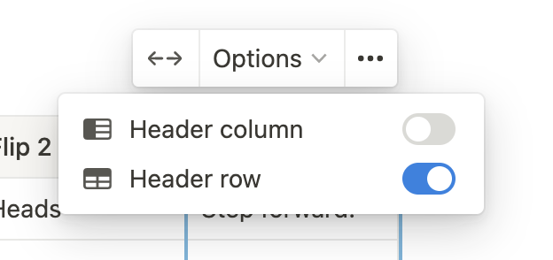
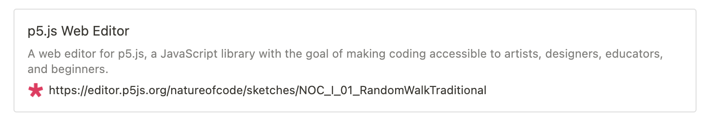

# Import Schemes

Here defines what will happens in the `import-notion-docs` script. The output `HTML`s will then become source for both print and web edition.

## 0. Page

Everything in a page will be injected to a `section` element with a `h1` title at the top.

### Output

```html
<section data-type="chapter">
  <h1>Introduction</h1>
  ...
</section>
```

## 1. Heading 1/2/3

headings are transformed with styles

### Example

## I.1 Random `Walks`

### Output

```jsx
<h2>I.1 Random <code>Walks</code></h2>
```

## 2. Paragraph

Paragraphs are transformed separately whether or not they are nested.

### Example

Here we are: the beginning. Well, almost the beginning. If it’s been a while since you’ve done any programming in JavaScript (or any math, for that matter), this introduction will get your mind back into computational thinking before I approach some of the more difficult and complex material.

In Chapter 1, I’m going to talk about the concept of a vector and how it will serve as the building block for simulating motion throughout this book. But before I take that step, let’s think about what it means for something to simply move around the screen. Let’s begin with one of the best-known and simplest simulations of motion—the random walk.

### Output

```html
<p>Here we are: the beginning. Well, almost the beginning. If it’s been a while since you’ve done any programming in JavaScript (or any math, for that matter), this introduction will get your mind back into computational thinking before I approach some of the more difficult and complex material.</p>
<p>In Chapter 1, I’m going to talk about the concept of a vector and how it will serve as the building block for simulating motion throughout this book. But before I take that step, let’s think about what it means for something to simply move around the screen. Let’s begin with one of the best-known and simplest simulations of motion—the random walk.</p>
```

## 3. Quote

All quotes will be added an attribute: `data-type="epigraph"`, and every line inside are transformed to paragraphs

### Example

> “Reading about nature is fine, but if a person walks in the woods and listens carefully, they can learn more than what is in books.”
> — George Washington Carver

### Output

```html
<blockquote data-type="epigraph">
  <p>“Reading about nature is fine, but if a person walks in the woods and listens carefully, they can learn more than what is in books.”</p>
  <p>— George Washington Carver</p>
</blockquote>
```

## 4. List

Nested list with styles

### Example

1. ***Death.*** If a cell is alive (state = 1) it will die (state becomes 0) under the following circumstances.
    - ***Overpopulation:*** If the cell has four or more alive neighbors, it dies.
    - ***Loneliness:*** If the cell has one or fewer alive neighbors, it dies.
2. ***Birth.*** If a cell is dead (state = 0) it will come to life (state becomes 1) if it has exactly three alive neighbors (no more, no less).
3. ***Stasis.*** In all other cases, the cell state does not change. To be thorough, let’s describe those scenarios.
    - ***Staying Alive:*** If a cell is alive and has exactly two or three live neighbors, it stays alive.
    - ***Staying Dead:*** If a cell is dead and has anything other than three live neighbors, it stays dead.

### Output

```html
<ol>
  <li><strong><em>Death.</em></strong> If a cell is alive (state = 1) it will die (state becomes 0) under the following circumstances.
    <ul>
      <li><strong><em>Overpopulation:</em></strong> If the cell has four or more alive neighbors, it dies.</li>
      <li><strong><em>Loneliness:</em></strong> If the cell has one or fewer alive neighbors, it dies.</li>
    </ul>
  </li>
  <li><strong><em>Birth.</em></strong> If a cell is dead (state = 0) it will come to life (state becomes 1) if it has exactly three alive neighbors (no more, no less).</li>
  <li><strong><em>Stasis.</em></strong> In all other cases, the cell state does not change. To be thorough, let’s describe those scenarios.
    <ul>
      <li><strong><em>Staying Alive:</em></strong> If a cell is alive and has exactly two or three live neighbors, it stays alive.</li>
      <li><strong><em>Staying Dead:</em></strong> If a cell is dead and has anything other than three live neighbors, it stays dead.</li>
    </ul>
  </li>
</ol>
```

## 5. Image

Images are downloaded and referenced relatively with path as `images/{chapter}/{chapter}_{index}.{extension}`. For caption, annotated code part are turned to class and the rest will be the content of `figcaption` and images’ alternative text.

### Example


`half-width-right another-class`Figure I.1

### Output

```html
<figure class="half-width-right another-class">
  
  <figcaption>Figure I.1</figcaption>
</figure>
```

## 6. Table

If `Header row` is active, the first line will become table head.



### Example

| Flip 1 | Flip 2 | Result         |
| ------ | ------ | -------------- |
| Heads  | Heads  | Step forward.  |
| Heads  | Tails  | Step right.    |
| Tails  | Heads  | Step left.     |
| Tails  | Tails  | Step backward. |

### Output

```html
<table>
  <thead>
    <tr>
      <th>Flip 1</th>
      <th>Flip 2</th>
      <th>Result</th>
    </tr>
  </thead>
  <tbody>
    <tr>
      <td>Heads</td>
      <td>Heads</td>
      <td>Step forward.</td>
    </tr>
    <tr>
      <td>Heads</td>
      <td>Tails</td>
      <td>Step right.</td>
    </tr>
    <tr>
      <td>Tails</td>
      <td>Heads</td>
      <td>Step left.</td>
    </tr>
    <tr>
      <td>Tails</td>
      <td>Tails</td>
      <td>Step backward.</td>
    </tr>
  </tbody>
</table>
```

## 7. Code Block

`codesplit` class is added to every block as well as the language

### Example

```jsx
let position = createVector(100, 100);
let velocity = createVector(1, 3.3);
```

### Output

```html
<pre class="codesplit" data-code-language="javascript">let position = createVector(100, 100);
let velocity = createVector(1, 3.3);</pre>
```

## 8. Equation Block

consider use `\textrm{}` for freeform text - [Discussion](https://github.com/nature-of-code/book-website-2nd-edition/issues/91)

### Example

$$
\textrm{number of aces} / \textrm{number of cards} = 4 / 52 = 0.077 \approx 8\%
$$

### Output

```html
<div data-type="equation">\textrm{number of aces} / \textrm{number of cards} = 4 / 52 = 0.077 \approx 8\%</div>
```

## 9. Embed p5 sketch

Bookmark links that pointed to p5 web editor (with hostname of `editor.p5js.org`) will be transformed to an `div` later handled by gatsby.js

Sketches will be downloaded and referenced relatively with path as `examples/{chapter}/{sketch_name}/`

If an `screenshot.png` file exist in the sketch, it will be inserted as an image figure under that `div`and appear in the pdf build.

### Example

[Link Bookmark](https://editor.p5js.org/natureofcode/sketches/NOC_I_01_RandomWalkTraditional) looks like this in Notion



### Output

```html
<div data-type="embed" data-p5-editor="https://editor.p5js.org/natureofcode/sketches/NOC_I_01_RandomWalkTraditional" data-example-path="examples/00_7_introduction/noc_i_01_random_walk_traditional">
  <figure class="screenshot">
    
  </figure>
</div>
```

## 10. Column List & Column

### Example


### Output

```html
<div class="col-list">
  <div>
    <p>Demo Text</p>
  </div>
  <div>
    <p>Demo Text</p>
  </div>
</div>
```

## 11. Indexterm

Callout block with emoji icon 🔗 is considered as indexterm. Up to three terms will be transformed as `data-primary`, `data-secondary`, and `data-tertiary` separated by `/`. Noted color won't affect its behavior

Noted that whitespaces are omitted at both ends of a term, e.g. `a / b` equals to `a/b`

### Example


### Output

```html
<a data-type="indexterm" data-primary="natural phenomena" data-secondary="modeling with random walks"></a>
```

## 12. Highlight

Callout block with emoji icon 💡 is considered as highlight.

### Example


### Output

```html
<p><span class="highlight">An object at rest stays at rest and an object in motion stays in motion at a constant speed and direction unless acted upon by an unbalanced force.</span></p>
```

### 13. Note, Exercise, Project, Example

These four kinds of callout blocks will be transformed to different type of div based on their emoji icon. The first line of text will became a `<h3>` title and the rest will be injected as children

- 📒 → Note
- ✏️ → Exercise
- 🦎 → Project
- 💻 → Example

### Example


### Output

```html
<div data-type="exercise">
  <h3>Exercise I.9</h3>
  <p>Add a third argument to noise that increments once per cycle through <code>draw()</code> to animate the two-dimensional noise.</p>
</div>
```
